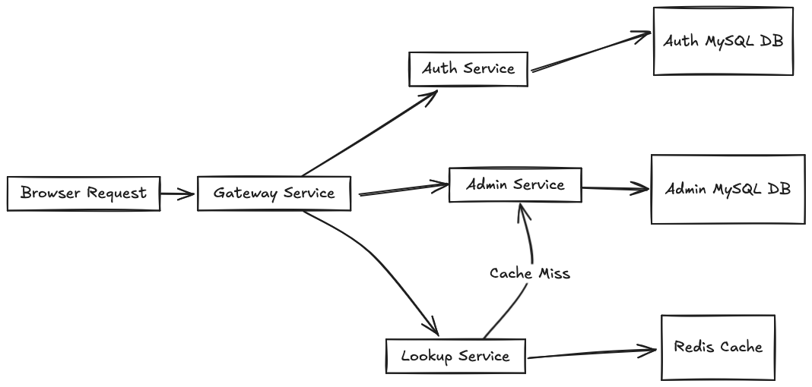

# shorturl

shorturl is a mock project designed to practice microservice architecture by providing a URL shortening service.

## Table of Contents

- [shorturl](#shorturl)
  - [Table of Contents](#table-of-contents)
  - [Introduction](#introduction)
  - [Architecture](#architecture)
  - [Services](#services)
    - [Auth Service](#auth-service)
    - [Admin Service](#admin-service)
    - [Lookup Service](#lookup-service)
  - [Request Flow](#request-flow)
  - [Technologies](#technologies)
  - [Getting Started](#getting-started)
    - [Prerequisites](#prerequisites)
    - [Installation](#installation)
    - [Notes](#notes)
  - [License](#license)

## Introduction

shorturl enables users to shorten long URLs, facilitating easy sharing and management. The application is divided into three main microservices—Auth, Admin, and Lookup—each responsible for distinct functionalities to ensure scalability and maintainability.

## Architecture

The system leverages a microservice architecture to handle different aspects of URL shortening efficiently.

## Services

### Auth Service

Handles user registration and authentication. Utilizes JWT tokens to facilitate stateless authorization across other services.

- **Responsibilities:**
  - User signup and signin
  - JWT token generation and validation

### Admin Service

Provides functionalities for managing URL mappings.

- **Features:**
  - Register new long URL to short URL mappings
  - Delete existing short URLs
  - Retrieve a list of all mapped URLs

### Lookup Service

Redirects short URLs to their original long URLs or returns appropriate errors if the short URL is invalid.

- **Capabilities:**
  - Resolve short URLs to original URLs
  - Handle redirection logic

## Request Flow



## Technologies

- **Backend:** GoLang, Gin framework
- **Database:** MySQL for Auth and Admin services
- **Caching:** Redis
- **Authentication:** JWT
- **Others:** Docker

## Getting Started

### Prerequisites

- GoLang
- MySQL
- Redis
- Docker

### Installation

1. **Clone the repository:**

    ```bash
    git clone https://github.com/yourusername/shorturl.git
    ```

2. **Navigate to the project directory:**

    ```bash
    cd shorturl
    ```

3. **Configure the local env variables:**

    ```bash
    cp .env.example .env
    ```

4. **check ports availability**

Once the `.env`variables are set, make sure no other service is using the ports specified in the `.env` file.

5. **Start,Stop the services:**

    ```bash
    make start_local
    make stop_local
    make start_local_with_build
    ```

6. **Set you /etc/hosts file**

You must add the following row to your `/etc/hosts` file:

```
127.0.0.1 shorturl.com
```

in order to be able to access the services from the browser on your local machine.

### Notes

The local setup exposes each service to the host machine; this is only for debugging purposes. In the staging and production environments, only the gateway service must be exposed to the outside world. If you deploy each service on different VPS, be sure to set the containers' ports exposure accordingly.

## License

This project is licensed under the MIT License.
